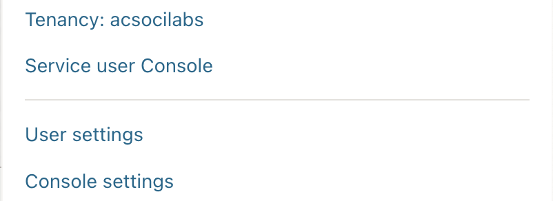

> #  **Documentation for OCI VCN creation with Terraform.**
>
> ## To Begin
- Google terraform documentation.

- Go to OCI provider on Terraform documentaion site

- Open OCI console.

> we open the console to get the OCID, API Key, Compartment ID etc

This would look something like this:



- **Create variable.tf** : used to define variables on terraform.

- **Create instance.tf**

- **Create terraform.tfvars** : used to abstract or hide sensitive variables in terraform such as ocid, user credentials,fingerprint,keypath,region.

- **Create .gitignore**

Complete resources id on variable.tf file such as compartment-id etc.
Document all unexposed file in `.gitignore` folder

```
terraform init
```

To initialize terraform in the project folder. Then,

``` 
terraform plan
```
To list out all the intending resources to be created.

```
terraform apply
```
This creates all the resources and adds a `terraform.tfstate` file into the folder.
